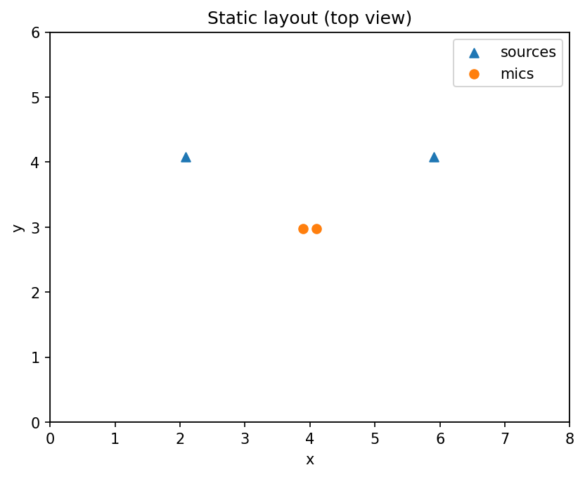
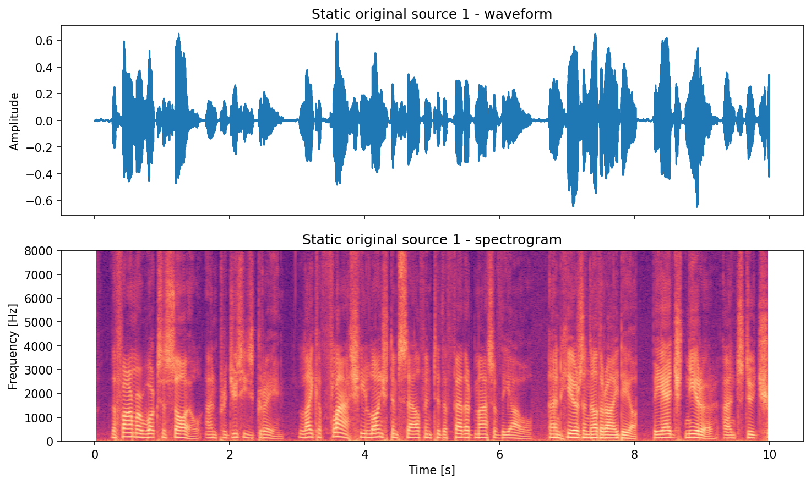
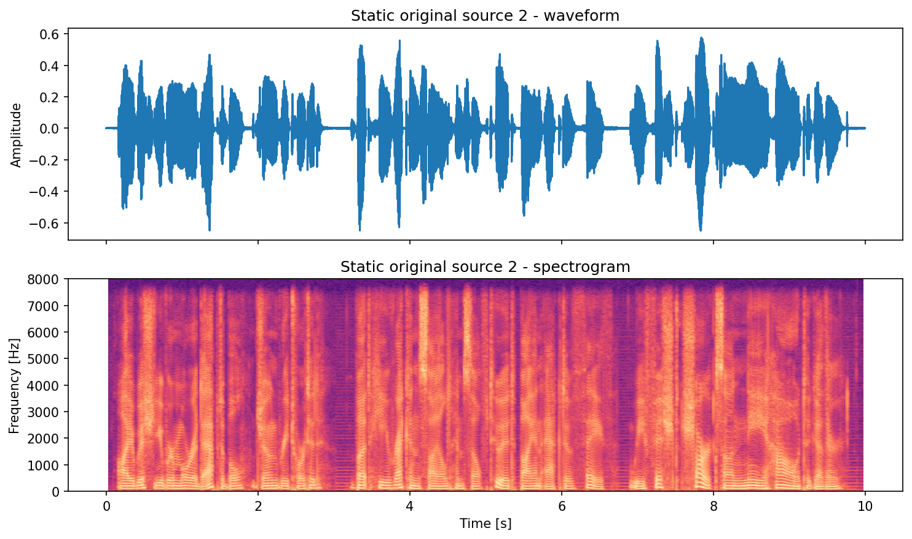
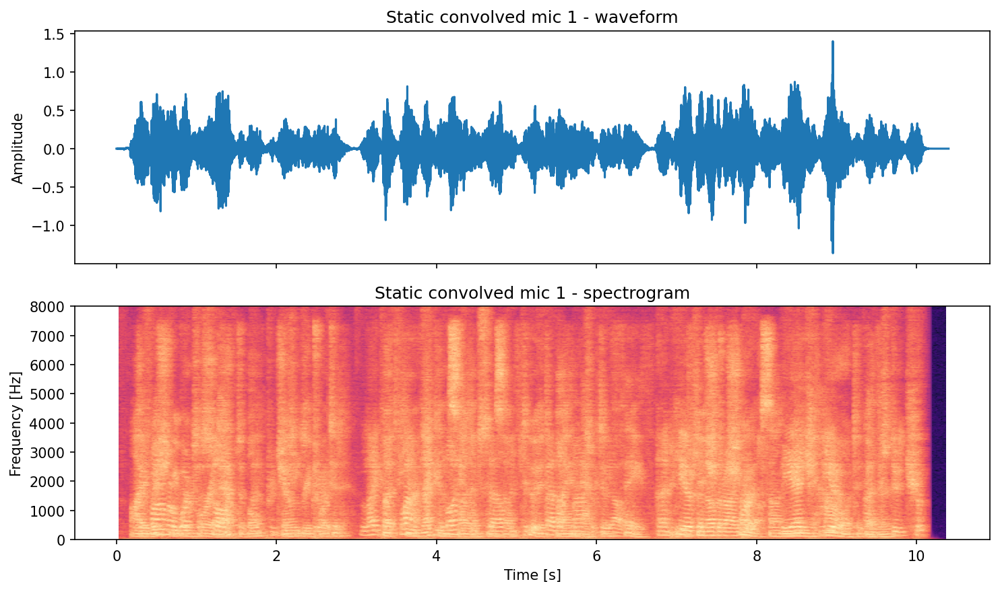
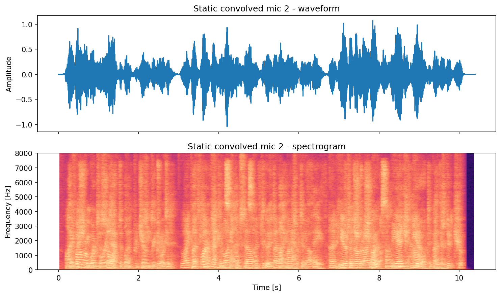
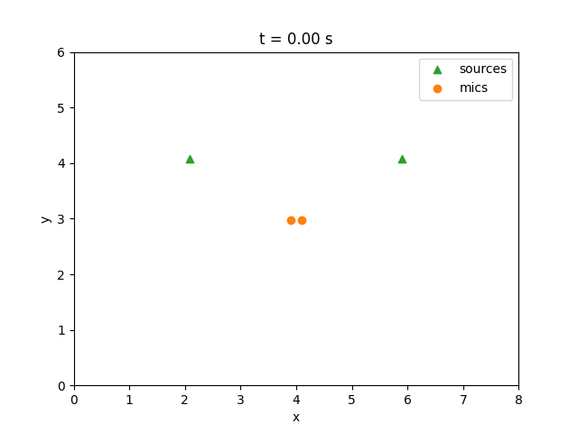
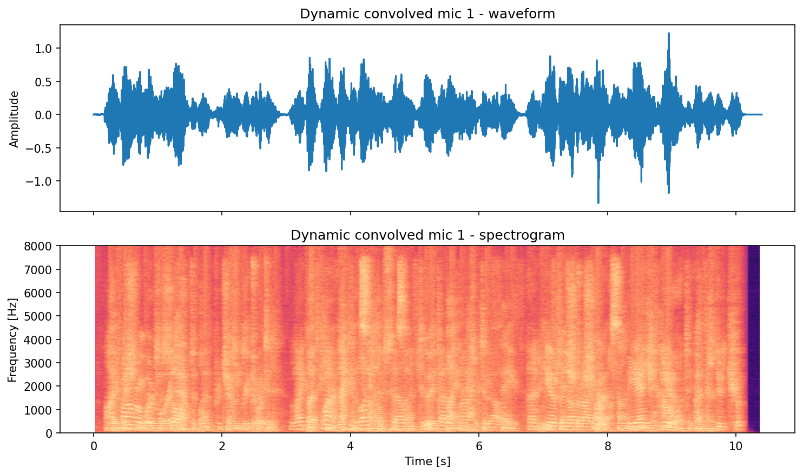

# Getting Started

This page demonstrates an end-to-end workflow with speech signals from CMU ARCTIC:

1. Download utterances for two speakers via `torchrir.datasets`.
2. Build 10-second source signals by concatenating random utterances and clipping.
3. Simulate static and dynamic RIRs under constrained source-array geometry.
4. Save WAV outputs, layout plots, waveform/spectrogram plots, and a dynamic GIF.

All code blocks on this page are sourced from `examples/getting_started.py`.

## Install

```bash
pip install torchrir
```

## 0) Common Setup (Dataset + Geometry Constraints)

```python
--8<-- "examples/getting_started.py:common_setup"
```

## 1) Static RIR + Convolution + Plots

```python
--8<-- "examples/getting_started.py:static"
```

Static preview (generated by running the code above):







Source 1 (original):
<audio controls preload="none" src="assets/getting-started/static_original_src01.wav"></audio>

Source 2 (original):
<audio controls preload="none" src="assets/getting-started/static_original_src02.wav"></audio>

Mic mixture (convolved):
<audio controls preload="none" src="assets/getting-started/static_convolved.wav"></audio>

## 2) Dynamic RIR + Trajectory Convolution + Animation

```python
--8<-- "examples/getting_started.py:dynamic"
```

Dynamic preview (generated by running the code above):







Source 1 (original):
<audio controls preload="none" src="assets/getting-started/dynamic_original_src01.wav"></audio>

Source 2 (original):
<audio controls preload="none" src="assets/getting-started/dynamic_original_src02.wav"></audio>

Mic mixture (convolved):
<audio controls preload="none" src="assets/getting-started/dynamic_convolved.wav"></audio>

!!! note
    The first dataset download can take time and requires network access.
    GIF generation requires Pillow through Matplotlib's animation writer.
    `device="auto"` may select `mps` or `cuda`; if you want a warning-free tutorial run, use `device="cpu"`.

## Next Steps

- See [Examples](examples.md) for CLI workflows and dataset generation scripts.
- See [API documentation](api.md) for all options and full signatures.
